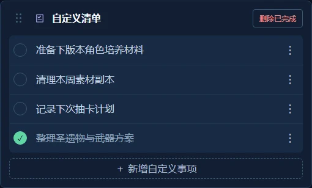
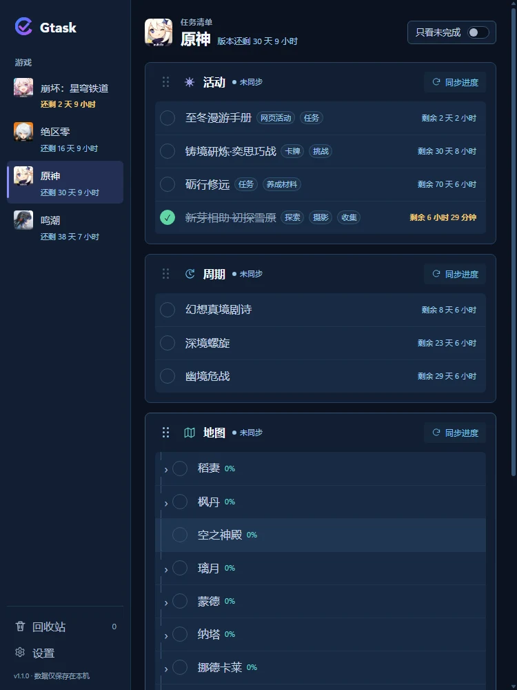
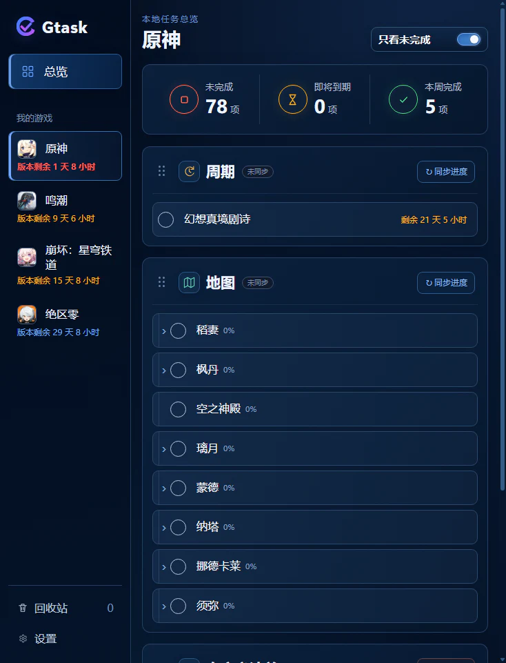
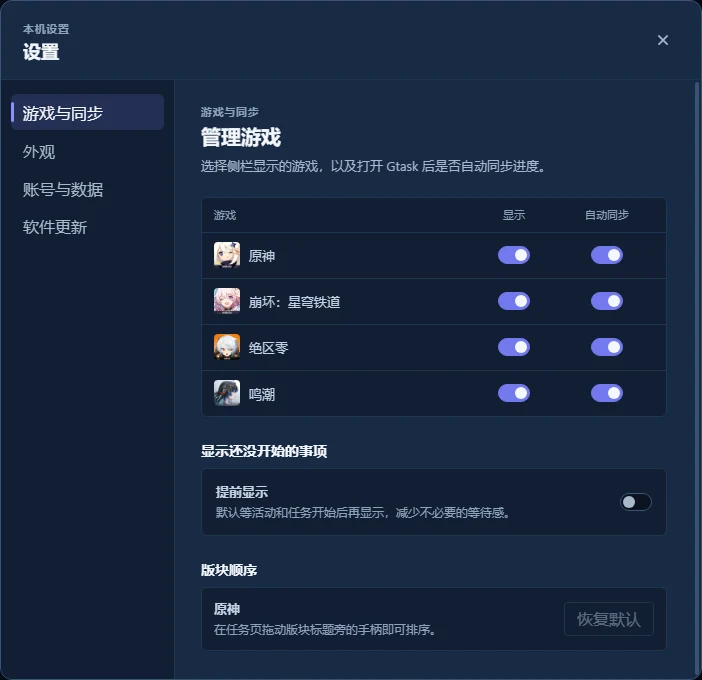
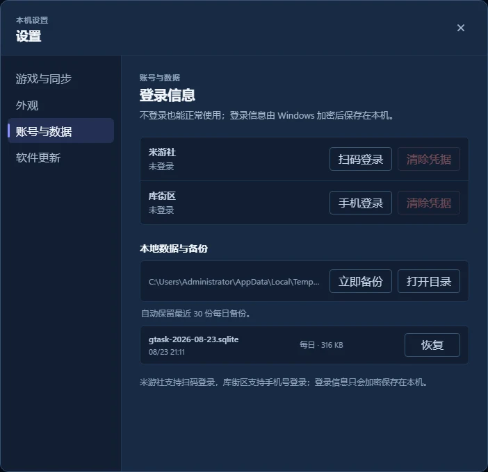

# Gtask

Gtask 是一款 Windows 桌面游戏任务清单。它集中显示版本倒计时、限时活动、周期挑战、地图探索和用户自定义事项。无需登录即可查看内置清单；登录米游社或库街区后，可以同步官方接口能够可靠提供的完成状态与探索进度。清单、凭据和备份默认保存在本机。

当前内置支持原神、崩坏：星穹铁道、绝区零和鸣潮，架构可继续扩展其他游戏。

这个项目来自一个很朴素的需求：玩的游戏多起来以后，很难随时记住每款游戏当前有哪些活动、周期任务和探索事项；进入游戏再逐层翻菜单，信息一多也容易看花或漏掉。Gtask 希望把这些内容整理成一个打开就能查看的本地清单。

项目发布者不会编程，负责提出使用需求、判断交互取舍和人工验收；代码、测试、构建脚本及技术文档均由 OpenAI Codex 根据这些需求实现和维护。

## 功能概览

| 功能 | 行为 |
| --- | --- |
| 游戏总览 | 切换查看多款游戏的版本剩余时间、活动、周期挑战和地图探索。 |
| 内置清单 | 不登录也能查看公共基准提供的清单结构和时间。 |
| 即将开放事项 | 默认隐藏尚未开始的公共基准事项；可在设置中提前显示，到点后自动出现。 |
| 未完成筛选 | 隐藏已完成事项和空版块，保留未完成地图子区域。 |
| 个人进度同步 | 米游社与库街区个人接口只更新唯一匹配项的完成状态或探索度。 |
| 自定义清单 | 支持新增、编辑、完成、删除和回收站恢复。 |
| 本地数据 | 清单保存在 SQLite，凭据由 Windows DPAPI 加密，并提供自动和手动备份。 |

## 软件快照

### 游戏总览

<p align="center">
  
</p>

### 自定义清单

自定义清单支持新增、编辑、完成、删除已完成事项和回收站恢复。

| 自定义清单 | 新增事项 |
| --- | --- |
|  |  |

### 未完成筛选

| 显示全部事项 | 只看未完成 |
| --- | --- |
|  |  |

### 设置与本地数据

| 游戏显示与启动同步 | 凭据、本地数据与备份 |
| --- | --- |
|  |  |

## 当前支持

| 游戏 | 完整公共清单 | 个人进度同步 |
| --- | --- | --- |
| 原神 | 版本、活动、周期、地图 | 活动、周期、地图 |
| 崩坏：星穹铁道 | 版本、活动、周期、地图 | 活动、周期 |
| 绝区零 | 版本、活动、周期、地图 | 活动、周期、地图 |
| 鸣潮 | 版本、活动、周期、地图 | 周期、地图 |

个人进度同步能力取决于官方接口实际提供的字段。未匹配或无法可靠判定的状态不会覆盖本地清单；用户手动完成状态受到保护。

## 下载与安装

中国区网络优先前往 [Gitee Releases](https://gitee.com/l3rui/Gtask/releases)，也可以从权威源 [GitHub Releases](https://github.com/BaiQue3rL/Gtask/releases/latest) 下载 Windows 版本：

- `Gtask-x.y.z-setup.exe`：安装版。
- `Gtask-x.y.z-portable.exe`：便携版。

覆盖升级不会删除数据库、凭据或备份。GitHub 保存权威提交、标签和发布说明；Gitee 自动镜像源码，并作为中国区默认更新检查与下载入口。任一镜像不可用时均可切换到另一个仓库。项目不自建下载服务器，也不使用付费对象存储或 CDN，因此无法承诺不同网络环境下的下载速度和可用性。

## 本地数据与隐私

首次启动后，应用在 Windows 系统“文档”目录下创建：

- `Gtask/data/gtask.sqlite`
- `Gtask/backups`
- `Gtask/logs`

凭据独立保存在当前 Windows 用户的应用数据目录，并由 Windows DPAPI 加密。应用支持每日备份、迁移前备份、恢复前备份和手动备份。备份轮换规则见 [数据模型](docs/data-model.md)。

## 本地开发

需要 Node.js 24+ 和 pnpm 11+。

```powershell
pnpm install
pnpm dev
```

常用验证与构建：

```powershell
pnpm typecheck
pnpm test
pnpm build
pnpm package:dir
pnpm package:portable
pnpm package:installer
```

技术栈：Electron + Vue 3 + TypeScript + SQLite（Node 内置 `node:sqlite`）。正式 Windows 安装包使用 NSIS。

## 维护与架构

Gtask 的内置活动、周期挑战、地图层级和版本窗口来自持久、已验证的公共基准；个人接口只更新完成或探索进度，不拥有目录结构。大型结构、适配器或程序变更通过软件版本发布。

- [开发状态](docs/development-status.md)
- [数据模型](docs/data-model.md)
- [同步架构基准](docs/sync-architecture-redesign.md)
- [本地维护接口](docs/local-command-api.md)

## 许可与非官方声明

项目代码使用 [MIT License](LICENSE)。Gtask 是非官方开源项目，不隶属于、未获得米哈游、HoYoverse、库洛游戏或相关权利方的认可与背书。游戏名称和商标归各自权利人所有。

应用内游戏头像和相关游戏名称仅用于指明兼容对象，相关素材、名称和商标归各自权利人所有。
