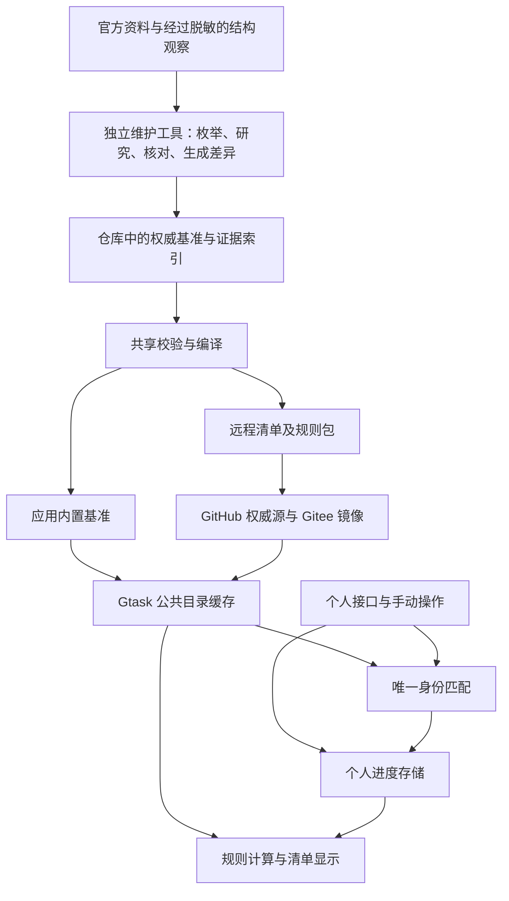

# Gtask 基准清单维护系统重设计方案

日期：2026-09-14。状态：**设计草案，尚未实施，不替代当前生效规则**。本稿不授权修改产品版本、发布安装包或迁移用户数据。

后续进展：用户随后授权全功能审计和必要修复，已落实的公共修订保护、退役记录、完成三态、事务回执、批量校验入口与 Skill 精简见 [审计报告](../functional-audit-2026-09-14.md)。本文以下“本轮仅设计/预检”等描述保留为当时讨论记录；后续可靠性目标又实现了受限 v2 协议、规则与未来窗口、缺截止时间复核、公开差异编译及同文件内置消费，实际标准见 `docs/catalog-maintenance.md`。日期精度/条件表达及常驻独立任务服务未实现，本文其余内容仍是历史草案；工作区能力不能等同于已发布客户端。

建议采用：**一份权威基准、一个维护工具、一套共享校验、两种分发产物**。研究由维护端负责；Gtask 接收已发布事实，执行明确规则，并同步个人进度。

**先看这一段：保留现有运行方式，优先缩短维护流程。**

- Gtask 继续读取统一清单，按清单里的游戏、类型和层级分发到各版块；启动、显示、换期和进度同步均不等待 Codex。
- 个人接口继续由软件自动解析、唯一匹配并写入完成状态或探索进度；保留手动状态优先和已有跨期保护。Codex 不参与日常个人数据语义复核，也不逐条写玩家数据库。
- 维护程序收集资料、复用有效证据并整理差异；Codex 批量核验需要判断的新增、变化和疑点，输出结构化变更集；程序完成校验、生成清单和获授权的发布，应用自行批量接收。
- 优先做差异预处理、批量提交、证据复用和文档精简。后文的独立任务服务、分片协议及数据库重构是按实际需要逐项引入的后续设计，不是提速必须先完成的工程。

职责分工是：**Codex 判断公共事实，程序执行机械处理，Gtask 使用清单和同步个人进度。** 内置和远程是同一清单的两种分发方式，不恢复多套目录所有者或数据源切换。

实施顺序调整为：**先做全功能审计，以周期时间和完成状态为最高优先级，再按发现决定修复与重设计范围。** 本轮仅完成设计讨论和定向预检，尚未完成全功能审计。现有“统一清单分发 + 软件同步个人进度”是审计必须保护的架构边界。

**1. 现状中真正需要解决的问题**

| 当前情况 | 实际影响 | 新系统的处理 |
| --- | --- | --- |
| 活动、地图、周期规则分别写在 TypeScript，本机 MCP 又能改数据库，远程清单还需另行整理 | 同一事实有多个可编辑副本，源码、安装包、本机、远端可能不一致 | 仓库公共数据成为唯一维护源，其他均为生成物或消费副本 |
| 周期规范要求维护规则，接口主要接收本期窗口，滚动常量仍在代码中 | 校正当前一期后，下一期可能按旧规则算回去；数据纠错需要软件发版 | 发布有类型的周期规则、适用范围和一次性例外 |
| 活动必须有两个绝对时间戳，且用是否有时间代替限时资格判断 | 既不能可靠排除常驻内容，又容易遗漏已确认限时但缺少精确时刻的活动 | 先核实限时资格，再按来源精度表达时间；缺时间的例外必须复核 |
| 应用退出会取消活动维护任务；精确领取返回空时旧 Skill 要求结束 | 桌面应用状态影响研究工作，任务中断与核查完成容易混淆 | 维护进程和任务存储独立，按任务 ID 恢复，明确区分原因 |
| Skill、动态契约、AGENTS、多个交接文件重复描述规则 | 同一事项出现互相不一致的标准；每次维护要重新解释历史 | 当前标准只有一个入口，接口约束共享实现，历史记录不再参与指令路由 |
| 以总核验时间、当前已存在的候选集表示“完整” | 重查时间可能被误当数据更新，未知新增项和待核实项容易丢失 | 分开记录数据修订、资料核验时间和范围覆盖情况 |

已核对的工程依据包括：[维护 Skill](../../integrations/gtask/skills/sync-gtask-schedules/SKILL.md)、[动态契约](../../src/main/sync/interface-contract.ts)、[应用退出流程](../../src/main/index.ts)、[周期目录](../../src/main/sync/cycle-catalog.ts)、[远程清单协议](../../src/main/remote-catalog-update.ts)、[种子和数据库写入](../../src/main/database.ts)。旧文档中同时存在“预计开服时刻入库”和“必须取得精确时刻”的记录，不能继续靠 Agent 临场选择解释。

9 月 14 日的维护也说明：任务失效、部分资料待核实、源码推送、远端清单可用、本机应用接收，是五种不同结果。新系统必须分别记录，不能以其中一项替代全部完成。

**2. 保留的产品边界**

- 当前内置四款游戏，游戏目录保持可扩展；新增游戏通过配置和相应能力支持接入。
- 公共目录决定名称、身份、玩法标签、地图层级、活动档期、版本和周期规则。个人接口只更新唯一匹配项的进度；未匹配记录不能创建、改名或校时。
- 公共活动清单以限时参与事项为范围。常驻活动、长期一次性任务和永久玩法不自动进入；时间缺失不能作为常驻或限时的判断依据。
- 手动完成锁、自定义事项、账号绑定、备份和凭据保持独立。维护工具不需要获得这些数据的写权限。
- 地图维持 `region` / `subregion` 两级，收录前确认它是可独立记录探索进度的地点；不能仅凭场景名称、宝箱或成就数量推定。
- 运行时只能计算已发布规则的结果，或按已发布终止条件处理事项，不能从个人战绩推导规则。
- 普通用户无需安装 Codex、Skill 或维护插件；研究、任务队列和发布控制不进入普通产品界面。
- 保留 GitHub 权威、Gitee 镜像及离线使用，不引入常驻云数据库或必须付费的服务。

**3. 整体结构**



维护工具使用现有 Node.js / TypeScript 技术栈。CLI 与 MCP 是同一个维护库的两个入口，调用同一套校验和发布流程；不另写两套业务逻辑。MCP 不依赖 Electron 主进程或正式安装目录存活。

建议的目录如下，均为未来结构示意：

```text
catalog/
  games/<gameId>/             # 活动、地图、周期、版本边界等权威 JSON
  taxonomy.json              # 共用玩法词汇
  evidence/                  # 可公开的来源与字段事实摘要
  audits/                    # 每轮范围、结论、变更和待核实清单
src/catalog-core/            # 类型、规则、身份、校验、计算和编译
maintenance/                 # 维护 CLI/MCP；不进入普通应用运行依赖
updates/catalog-v2/          # 自动生成的清单、不可变数据文件和清单索引
.gtask-maintenance/          # 被 Git 忽略的任务、租约、检查点及本机回执
```

首期维护使用单进程命令和 `.gtask-maintenance/` 内的原子检查点文件；确有多任务并发、抢占恢复需求时，再使用独立小型 SQLite 工作库。两种方式均不读写玩家数据库。权威公共事实仍是可审查的仓库文件。离线核查不依赖应用在线；缺少第一方观察时使用公开资料，并记录证据范围。

**4. 一份数据同时供内置和热更新使用**

权威数据按游戏拆分，所有记录使用显式稳定 ID。既有 `remoteKey` 原样保留；新条目由维护工具分配 ID，不再用标题和父级重新计算身份。改名只改显示字段；父级纠正保留地点 ID，并检查绑定影响。相同活动名称在不同版本真正再次举办时是新活动；周期挑战则始终是同一个模式。

编译器从同一份数据生成应用内置快照和远程产物。禁止人工分别维护这两份结果，CI 验证重新生成后不存在差异。本机缓存不得作为未经核查的仓库来源；历史上仅存在于本机的公共变化，要通过专用的公共结构导出、逐项比对后导入，不能导出整库。

把三种版本号分开：应用版本描述软件能力，协议版本描述可读取的数据结构，清单修订描述已发布事实。核验一遍但事实未变，只记录核验结果，不修改条目修订、不重发清单、更不升级应用版本。

公共数据包含删除/退役记录及其生效修订。客户端不以“快照没出现”推断删除，旧安装包也不能重新生成已退役的条目。公共目录和个人进度逐步分表，以稳定 ID 关联；退役目录项退出当前清单，个人状态不因公共行被删除而连带丢失。

**5. 重新定义时间，解决漏项和假精度**

取消“所有时间必须强行压成绝对时间戳”的设计，但不因此放宽活动的限时资格。先依据第 7 节确认是否应当收录，再表达时间。时间采用有限、可校验的表示，不能上传任意表达式或可执行脚本。

| 时间事实 | 保存内容 | 用户看到的行为 |
| --- | --- | --- |
| 官方精确时刻 | 时刻、服务器时区、秒或分钟精度 | 显示倒计时，按已定义边界机械切换 |
| 官方只给日期 | 日期及服务器时区 | 显示日期，不伪造 00:00、23:59 或秒级倒计时 |
| 官方给出关联条件 | 指向指定版本的更新完成、维护开始等已发布边界 | 显示“版本更新后开放”等真实条件；条件被确认发生后显示已开始 |
| 规则推算的预计时刻 | 使用的规则、推算依据、预计状态 | 明确显示“预计”，不伪装成官宣 |
| 已确认限时且当前开放，可靠截止时间未找到 | 限时与开放证据、缺失时间字段、例外原因及复核节点 | 符合第 7 节例外条件时显示“截止时间待确认”，不显示虚构倒计时 |
| 活动身份、限时性质或是否开放的信息不足或冲突 | 缺失字段、冲突证据、下一步核查条件 | 留在维护草稿，不新增到用户清单；已有条目按第 7 节复核 |

一个活动的名称、独立活动身份和参与边界得到确认后，可以使用“版本更新完成”作为开始条件，不必知道开服的实际秒数。例如全新放送可以保存“3.2 更新完成后开始，10 月 20 日 03:59 结束”。更新边界可以被维护端确认“已经发生”，同时实际发生时刻仍为空；确认时刻不是实际发生时刻。客户端只读取这个已发布结论，不自行从个人接口猜开服时间。

如果只有“预计维护五小时”，它仍然只是预计，不能自动转成实际完成时间。截止时间不明确时，不执行不可逆的到期删除；需要明确结束边界或维护端发布已结束结论。

时间解释同时区分：维护开始、更新完成、活动参与截止、奖励领取截止。公告明确“03:59 含整分钟”时可规范到下一分钟的排他边界；含义不明时保留原始分钟精度并记录，不在不同文件中混用 `:00` 与 `:59`。开始和结束的精度可以不同，时区不明则不能自行补成北京时间。

这是一项明确的标准变更：**限时资格和时间完整性分别判断；允许保存真实但精度有限的时间事实，不允许捏造更精确的事实。** 未确认是否存在或是否限时的活动、只有名称而缺少可用开放依据的预告，仍不得进入用户清单。已确认限时且当前开放的活动，可以按第 7 节例外收录，但不能声称时间已经核实完整。

**6. 周期和版本维护规则，不维护每一期的副本**

周期目录保存稳定模式 ID、规则、规则生效区间以及官方例外。首版只实现有限的规则：固定间隔、每月指定日期、关联版本边界。开启间隔和开放持续时间独立，明确表示存在空档的玩法。

例外单独表达“这一期延长一周”“从某个边界起更换锚点”“临时停开”。未来例外可以提前发布，到达已声明的边界后机械生效，不覆盖仍在进行的一期。版本延期也采用相同的边界与例外体系。

同一期校时与进入新一期是不同操作。周期实例身份独立于可修正的起止时间和规则修订；同一期纠错保留完成状态，真正换期才重置。锚点纠正不得把历史期次重新编号；必要时发布仅涉及公共身份的映射，不包含个人完成数据。

规则数据和活动、地图一起热更新。客户端只能执行自己支持的规则类型；新算法仍需软件升级。这样可以解决“源码锚点修好、旧包下一期仍按错锚点计算”的问题，也不会让热更新变成远程执行代码。

**7. 各类清单的收录标准**

| 范围 | 纳入内容 | 排除或等待内容 |
| --- | --- | --- |
| 活动 | 官方独立命名且有可靠限时依据的活动容器；正在进行、已公告有开放依据的即将开启、跨版本活动及符合条件的网页活动 | 常驻活动、长期一次性任务、永久玩法、卡池、兑换码、商店、单个关卡、奖励档位、永久主线；限时性质不明或只有标题而缺开放依据的预告 |
| 周期 | 有独立入口和明确重复规则的稳定挑战模式 | 每层、每个难度、增益、敌人列表和按期复制的卡片 |
| 地图 | 官方名称、唯一父级、独立进度资格得到证实的两级地点 | 仅有剧情场景、宝箱或副本入口，不能证明独立进度的地点 |
| 版本 | 官方版本身份、维护/更新边界、已确认的常规节奏和例外 | 卡池切换、补偿领取截止或单活动结束时间冒充版本边界 |

活动按两个独立维度保存：生命周期性质（限时、常驻、未确认）和时间完整性。没有截止时间不等于常驻；有上线日期也不等于限时。清单用于提醒有参与期限的事项，不积累所有可以完成的长期内容。

| 情况 | 处理 |
| --- | --- |
| 已确认常驻或永久开放 | 不进入公共活动清单；确有独立重复规则的内容按周期标准另行判断 |
| 尚不能确认是否限时 | 留在维护候选队列，不进入用户清单 |
| 已确认限时，时间或关联边界足够表达 | 正常收录，保留来源精度 |
| 已确认限时且当前开放，但可靠截止时间未找到 | 满足以下条件时例外收录，保留时间缺口及复核任务 |

缺时间例外必须同时满足：有官方明确“限时”等可靠依据；有可核对的当前开放证据；已检查主要官方公告、活动规则等相关来源仍未取得可靠时限；记录证据、缺失字段、检查结果和下次复核节点。仅因出现在某版本介绍、位于游戏的“活动”页面或攻略称其为活动，不能认定它是限时内容。已公告的未来活动至少需要可用开放依据，例如“指定版本更新后”；只有“即将推出”而没有开放依据的内容保留在维护候选队列。

防止例外长期积累的规则如下：

- 例外显示“截止时间待确认”，不显示无限期、假倒计时或维护任务信息。候选和复核队列只对维护端可见。
- 每次覆盖该游戏的维护任务优先复核这些例外，版本切换时必须重新检查。复核节点只是检查触发条件，不能冒充活动截止日期；现有可靠证据仍有效时，不强求一篇新公告。
- 补齐时限后转为普通条目；确认已结束时正常退役；确认常驻时撤出公共活动清单。保留稳定 ID 和个人进度，记录撤出原因。
- 若原有开放依据已失效，维护端复核后仍无法确认是否继续开放，则发布“当前开放状态未确认、移出主清单”的决定，并转回维护候选队列。不能默认为已经结束，也不能一直留在主清单等待。客户端只应用已发布决定，不按天数、个人完成情况或沉默的接口自行删除。
- 常驻玩法附带限时奖励时，只在它满足独立活动标准且限时参与范围明确时收录对应限时事项；不把整个常驻玩法或各个奖励档位加入活动清单。到期撤出后不继续追踪永久部分。

地图资格可以由官方界面、公共目录结构，或清楚展示该地点独立进度的可靠材料证明；不要求拿到玩家自己的探索百分比。当前个人快照的一级进度仍优先于子地区平均值，目录增加子地区不覆盖该值。

玩法标签按实际操作描述。已有词汇不贴切时，在同一变更中提出新词汇及定义，例如弹球、养成，不把玩法硬塞进经营等近似标签。一个主要玩法足以表达就不凑多个；双倍奖励等标签作为补充。新词汇与引用它的条目一起校验、一起发布，旧客户端能力也必须可兼容。

历史条目不自动获得“已全部验证”的背书。导入时保留原身份和已有证据，缺溯源的标记为历史迁入，按游戏版本和风险逐步补查；不能为了重设计清空旧目录或改动已确认的用户进度。

**8. 证据、增量维护与完整核查标准**

先确定范围，再研究差异。范围清单覆盖适用的当前及跨版本活动、未来已公告活动、周期模式、地图新增/改名/归属、版本例外。既有基准是比较起点，不是“只有这些内容存在”的证明。

为缩短维护耗时，建议明确区分以下两类任务。这是拟议的新工作流；当前生效标准以及用户明确要求的完整核查范围不能被静默缩减。

- 日常增量维护：维护程序检查已配置官方入口中的新增公告、来源变化、已知缺口和到复核点的例外，把候选差异交给 Codex。未变且证据仍适用的事实复用原结论。来源抓取失败或缺少覆盖时标记未知，不能当作无变化。
- 完整核查：版本更新、来源结构变化或用户明确要求时，枚举指定范围，检查新增和漏项。完整覆盖不等于让 Codex 对每条旧记录重新搜索；程序整理全范围清单，Codex 重点核对差异和证据缺口，并报告范围覆盖情况。范围未覆盖时不能声称完成全量核查。

来源缓存和变更检测只帮助发现待核验事项，不能自动裁决公共目录增删改。新增、改名、时间校准和退役仍由维护端的 Codex 核验；客户端个人接口不会因此获得目录写权限。旧网页内容没变，也不自动证明活动今天仍开放，仍须检查证据的适用时间和待复核条件。

维护程序统一完成抓取缓存、确定性字段提取、去重、差异预览、证据引用、格式校验和产物生成。Codex 一次提交具有完整依赖的结构化变更集，不按游戏版块、条目或数据库行反复调用写入工具；校验失败只返回具体字段和依赖错误，修正后重试该变更集。复杂页面、含糊规则和互相冲突的来源再交由 Codex 深入研究。检查无差异只生成核查回执，不重写清单、不触发安装包构建。

来源优先为官方本地化公告、官方日历和经过审查的脱敏结构观察，缺失字段再查可靠攻略或 Wiki。转载同一公告不算两份独立证据；一份明确的一手证据已经足够时，不强求重复搜索。第一方观察是可选证据，不因本机没有登录记录而中断公开核查。

证据对应具体字段：这条公告证明名称和限时性质，那份规则证明截止时间，那个目录证明地图父级。限时资格、当前开放状态和截止时间分别留证，不能互相代替。记录来源地址、发布/观察/核验时间、服务器范围、支持字段和必要的事实摘要。把“官方确认”“按已发布规则计算”“待核实”作为明确状态，数值置信度只作辅助，不作为真实性凭证。

结构观察采取字段白名单和来源范围验证，只导出公开名称、规则、时间等资料。不导出账号、个人完成值、分数、探索百分比、原始响应或凭据。公开证据索引默认不提交用户截图、登录后的完整页面或大段文章副本。

每个候选有五种结论：新增、修正、退役、核实不变、待核实。待核实记录必须写清缺什么、已经查过哪些来源、什么新证据会解除阻塞；按字段保存，不能只把它留在一次聊天或长交接文档中。

**9. 可恢复的维护流程**

一次标准任务按以下顺序执行：

1. 创建明确游戏、范围、输出语言和服务器范围的维护任务，记录基准修订与规则版本。
2. 由维护程序读取完整公共快照及可用的脱敏观察，向 Codex 提供范围摘要、候选差异及相关记录；需要时可展开原始公共资料。四个版块的契约一次可见，不依赖先写入某版块才解锁下一版块。
3. 建立范围清单，复用仍适用的证据，研究新增、变化、缺失和冲突字段，持续保存证据和检查点。
4. 生成字段级变更集，明确新增、修改、删除、无变化和待核实项。
5. 用共享引擎验证身份、时间、规则、层级、证据覆盖与兼容性，在隔离数据库中模拟应用及换期。
6. Codex 提交一个已核验且依赖完整的变更集；维护程序批量写入权威资料，生成分发产物和可审查报告。应用数据库由客户端清单消费者写入，不要求 Codex 再逐条同步一遍。
7. 按用户本次请求或预先配置的发布授权提交、推送、核验线上内容；不重复索要已授予的授权。
8. 分别记录 GitHub 发布、Gitee 镜像和本机应用回执。未要求本机应用验证时标记未执行，不把远端发布当成本机已应用。

只有标准执行权限，不按 shell、MCP 等工具名字区分允许与否：公共基准文件、生成物、验证、提交推送属于相应维护范围；应用代码变更、数据库结构迁移和软件发版需要对应软件维护请求。CLI 与 MCP 都只能通过维护库执行公共写入。

首期按稳定任务 ID、检查点和单写入者恢复，并核对取消状态与基准修订；同一请求重试不重复创建数据。若后续引入多执行者任务服务，再增加租约和心跳：短期持有写入资格，心跳失效后进入可恢复状态；恢复必须检查该 job 的取消状态、最新基准、检查点及新的写入资格。旧执行者不得再提交，避免两个执行者交叉覆盖。

领取返回明确原因：不存在、他人执行中、租约到期、用户已取消、已完成、已被新修订替代。只有已有完成回执且覆盖本次范围，才可认定已完成；返回空、进程退出或模型说“成功”都不够。用户明确取消必须停止，不能以恢复机制绕过取消。

核查和发布状态分开：范围完整且无未决项才是完整核查通过；可以发布已验证的独立部分，但结果必须是“部分发布，仍有待核实项”。获准例外收录的限时活动也必须保留时间缺口，不能因为已经显示在清单上就改成“时间全部核实”。待核实范围继续保留，不能因代码已推送而消失。断网或应用退出不抹掉已经完成的研究。

**10. 一套契约与精简后的 Skill**

保留现有 Zod 技术栈，纯数据 schema、语义校验和规则计算集中在 `catalog-core`。CLI、MCP、生成器、测试和客户端共享相应模块。JSON Schema 用于生成工具入参及字段说明，跨条目约束和语义验证仍使用共享校验器，不能误以为 schema 可以证明官方事实。

本机已核对现有 Zod 4.0.0 提供 `toJSONSchema`。实现时只生成可表示的 JSON 类型，不能把无法表示的约束静默放宽为任意字段。[Zod 官方说明](https://zod.dev/json-schema)

新 Skill 只负责意图识别、读取本次契约、执行工作流、恢复任务和报告标准，不复制所有游戏排期、字段定义和历史禁令。细则以稳定规则编号、适用范围、失败原因和修正提示提供。协议或缓存不兼容时返回具体能力差异；受控公共资料仍可通过兼容 CLI 处理，不能扩大到玩家数据库写入。

**11. 发布和验证闭环**

首期沿用客户端现有统一清单入口及兼容协议，先改善维护端批量生成与验证。下面按游戏分片和内容地址分发的设计，待清单体积、更新频率或新协议能力有实际需求时再引入；Gtask 始终消费统一的清单入口，不逐版块等待 Codex 下发。

每次发布生成确定性的游戏快照及一份索引，带清单修订、内容哈希、协议版本、所需客户端能力和源资料哈希。未改动游戏继续引用旧快照。产物先完整生成并校验，再在同一次 Git 提交中更新索引；客户端先获取索引，再按内容地址获取对应数据，不混用不同修订。

发布写入需要互斥及基准修订比较。即使流水线限制并发，也不能假设运行次序；发现远端基准已变，重算变更并复核冲突，不能强推覆盖。GitHub Actions 的并发分组可以辅助限制发布任务重叠，但不是数据库锁和冲突检查的替代。[GitHub 官方说明](https://docs.github.com/en/actions/how-tos/write-workflows/choose-when-workflows-run/control-workflow-concurrency)

客户端完整校验整个适用批次后，在一个事务内更新公共事实、规则、退役记录和已应用修订。失败保留旧批次；不让磁盘状态文件先显示成功而数据库尚未提交。多游戏同批仍保持原子性。SQLite 的事务边界可继续承担这一职责。[SQLite 官方说明](https://www.sqlite.org/lang_transaction.html)

公开数据回退通过新修订恢复旧事实，保留用户进度；不倒退修订号，不回滚整份用户数据库。旧包内置资料不能覆盖更高修订的远端事实。

数据维护使用专门的 catalog CI：结构/语义校验、证据和范围检查、稳定 ID、地图依赖、时间边界、周期例外、兼容性和隔离应用测试。纯数据变化不打安装包。共享引擎、客户端或数据库变更才执行完整软件测试、类型检查、构建和相应迁移验证。

**12. 历史文件处置**

| 文件或组件 | 建议处置 |
| --- | --- |
| 根 `AGENTS.md` | 保留为短入口，只放产品边界和当前标准入口，不保存历次故障和重复字段表 |
| `sync-gtask-schedules/SKILL.md` | 重写为维护执行手册；仓库保留一个源，安装/缓存副本由打包生成并可核对版本 |
| `sync-architecture-redesign.md` | 收敛成当前架构说明，移除已经失效的实现描述 |
| `ai-map-catalog-maintenance.md` | 内容归入统一维护标准的地图章节；旧路径先保留迁移指引 |
| `remote-catalog-feed.md` | 成为从当前协议生成/校验的协议说明，附兼容策略 |
| `handoff-baseline-maintenance.md` 和 `next-session.md` 的历史段落 | 迁入带日期的历史记录，明确不是当前指令；先保留引用，再分批清理，不立即删除 |
| 每轮维护记录 | 结构化审计为主，生成便于阅读的简短报告；待核实项进入可追踪队列 |
| Electron 内的维护 worker/任务调度 | 独立维护工具上线且恢复路径验证后退役；普通应用只保留必要的公开观察导出和清单消费 |

最终人工阅读入口控制在：项目入口、当前架构、维护标准、发布/恢复手册，以及一份精简 Skill。程序契约由代码生成，历史日志按需读取。CI 检查生成内容漂移与断链，避免旧文档再次悄悄成为第二套规范。

**13. 分阶段迁移，不清库重建**

| 阶段 | 主要交付 | 验收重点 |
| --- | --- | --- |
| 前置：全功能审计 | 沿真实用户操作追踪界面、规则、接口、匹配、数据库和维护发布链路，按第 15 节输出发现 | 区分可复现缺陷、语义待确认、已覆盖行为和未验证范围；先确定根因与受影响范围 |
| 优先交付：缩短现有维护流程 | 现有清单入口和个人同步保持原架构；加入差异摘要、有效证据复用、批量变更提交及生成，精简重复指令 | Codex 不逐条写数据库；无变化不重发；正常使用不依赖 Codex；记录耗时与调用量进行前后比较 |
| 第一阶段：统一数据源 | 导入现有公开基准与累计归档；保留全部旧 ID；建立编译器、证据索引、审计记录和 catalog CI | 生成现有协议时语义一致，旧进度不变，其他游戏不被连带修改 |
| 第二阶段：补齐表达和消费能力 | 时间精度/关联边界、规则与未来例外、退役记录、数据修订优先级；发布一个经用户批准的兼容软件版本 | 旧协议并行保留；不能安全降级的字段不伪造；新客户端重启、换期、回退均通过 |
| 第三阶段：独立维护并退役旧流程 | 独立 CLI/MCP、检查点恢复和回执；重写 Skill、收敛文档，移除应用内旧研究调度 | 关闭 Gtask 仍可维护；取消与恢复行为明确；维护结果可追溯 |

先交付提速措施，再按实际收益选择后续阶段。多执行者服务、分片清单和数据库分表各自独立评估，不要求一次性全建。记录资料收集、Codex 核验、生成验证和发布四段耗时，以及模型调用量、写入调用量；优化前后使用相同范围和证据条件比较，不预先承诺未经测量的倍数。

旧协议过渡期由编译器生成兼容结果。关联时间和新规则若无法无损表达，则明确记录旧客户端未覆盖范围，不能编造绝对时刻或声称旧包已支持。已有客户端需要一次兼容升级，之后受支持规则的锚点、间隔和例外才可只发数据。

第一阶段不借迁移之机自动“修正”历史事实；先形成无语义变化的迁入结果，再将事实纠错作为独立可审查变更。涉及数据库迁移时备份、前向迁移、隔离验证，保留原凭据和用户数据；本方案不指定新的产品版本号。

**14. 用真实故障验收，而非只看测试数量**

1. 同一份基准生成内置资料和热更新，名称、稳定 ID、规则和时间语义一致。
2. 维护过程中关闭 Gtask，研究检查点还在，按同一 job 恢复；已取消任务不能复活，过期执行者不能写入。
3. “版本更新后开放”的活动可正常表达，界面不制造 11:00；只有日期的来源不产生假秒数。
4. 绝区零双周锚点校准后，当前及随后多期继续错峰；同一期校时不重置完成状态。
5. 提前发布星铁某一期延长的例外，不污染当前期，例外结束后按正确规则衔接。
6. 地图改名或父级纠正保留旧身份和用户进度；没有独立探索度的地点不能因为个人接口或宝箱攻略而自动加入。
7. 老安装包、旧镜像、延迟响应不能覆盖新事实，已退役条目重启后不会复活。
8. 任一数据非法、网络中断或提交失败，线上仍使用上一份完整有效清单，玩家进度保持原样。
9. 发布后分别能证明仓库提交、GitHub 清单、镜像清单、本机应用状态；没执行的检查不显示通过。
10. 四版块中有待核实项时保留具体缺口，不能显示“全部核查完成”；无差异的核查不制造数据更新。
11. 常驻活动即使有上线日期也不会入列；性质不明的活动只进入维护候选队列；已确认限时且开放、但缺可靠截止时间的活动可例外收录，并在后续维护中补齐、退役或发布撤出决定，不因时间为空而长期滞留。
12. Codex 不可用时，Gtask 仍可读取已发布清单、分发版块、按规则换期及同步个人进度；个人同步不调用模型，不生成公共目录，不覆盖手动锁，不将旧期战绩写入新一期。
13. 一次维护的机械写入按变更集批量完成；无变化不重新发布，抓取失败不伪装无变化；完整核查不因增量优化遗漏新条目。耗时和调用次数有前后记录，能够定位剩余瓶颈。

**15. 全功能审计：先核对行为，再决定改动**

审计理由是用户反复遇到跨模块错误，以及现有规则经过多轮修改；不能仅凭旧 Agent 的能力或测试数量判断整套实现是否正确。审计沿“用户操作 → 接口或规则 → 身份匹配 → 数据库存储 → 界面结果”追踪，同一行为同时核对维护端和已发布客户端。

| 顺序 | 范围 | 必须验证的实际行为 |
| --- | --- | --- |
| 第一批 | 周期、空窗和版本时间 | 开期间隔与开放时长分离；从锚点或发布规则求期次，不能从上次结束时间累计加天；空窗显示下期开启时间；跨月、跨年、长期离线及例外后继续正确；同一期校时不丢状态 |
| 第一批 | 完成语义与个人同步 | 按游戏、玩法列出本项目已约定的完成标准及可靠接口字段；区分玩家手动挑战、自动继承、扫荡和空记录；分清明确完成、明确未完成、未知；匹配账号、服务器、模式和期次，保护手动状态 |
| 第二批 | 公共清单与地图 | 收录范围、稳定身份、分类与两级层级正确；个人数据只写进度；地图当前快照一级进度优先；限时例外可追踪，不积累常驻内容 |
| 第二批 | 维护工具、Skill 与说明 | 当前契约一致；任务范围与完成回执一致；中断可恢复；复用证据和批量写入确实减少耗时；废弃路径不能重新取得目录控制权 |
| 第二批 | 清单发布及软件更新 | 内置、远程、镜像、本机修订优先级正确；失败整批回滚；退休条目不复活；实际安装包能力与源码、协议一致 |
| 第三批 | 数据、登录、备份恢复 | 账号隔离、凭据使用、迁移与备份恢复保持数据完整；部分响应和乱序旧响应不覆盖新结果；重启不改错完成状态 |
| 第三批 | 全部用户功能与性能 | 逐项检查版块显示、排序、筛选、倒计时、手动勾选、自定义事项、回收站、设置、启动和退出；界面与数据库结果一致；普通使用不调用 Codex、不被维护阻塞 |

周期审计使用固定时钟连续模拟多期及至少跨一个年度，覆盖开始前、开始点、结束点、空窗、下期开启、单期延期及恢复常规规则。示例规则“每 28 天开启、开放 21 天”必须稳定保留 7 天空窗；这是测试用例，不是任何游戏当前规则的断言。

完成状态审计使用有已知预期结果的脱敏真实接口样本与边界样本，检查解析结果、匹配结果、存储结果、界面结果及重启后的结果。先核对现有约定：周期目前按“本期存在符合条件的手动挑战记录”计完成，不能擅自改成满星、满奖励或全关通关；活动和地图按各自标准处理。无法判断的接口结果不应仅因布尔字段缺省而覆盖已有状态。具体接口字段是否足够证明结果，必须靠样本确认，不能让运行时模型临场裁决。

每个发现给出复现条件、预期与实际结果、证据、根因、影响范围和修复建议。已确认缺陷、待复现风险、需求语义歧义、已验证行为分别列出。缺真实样本或未做已安装客户端验证时如实标记，不把源码测试通过当成端到端通过。

本轮定向预检（2026-09-14）：

- 已读到 [周期计算](../../src/main/sync/cycle-catalog.ts) 使用独立 `cadenceDays` / `durationDays` 和固定锚点，已有 [空窗期与错峰测试](../../tests/cycle-catalog.test.ts)。不能据历史反馈断言当前仍是简单“结束后加 XX 天”。
- 已读到 [完成证据函数](../../src/main/sync/challenge-record-evidence.ts)、个人解析器和 [数据库写入](../../src/main/database.ts)。优先待复现风险是：无证据与明确未完成是否被压成相同布尔值，以及期次匹配、自动继承过滤是否覆盖实际接口形态；本轮未据此认定已发生具体缺陷。
- 运行周期目录、内置基准、四游戏个人解析、个人快照和数据库共 8 个测试文件：150 项通过，10 项跳过。该结果仅证明已有用例通过；未执行全功能、真实账号、已安装客户端或发布链路验收。
- 本轮仅修改设计草案；没有修改软件代码、玩家数据或生效 Skill。

本轮提供设计与定向预检。后续实施应先按审计证据确定修复范围，再分阶段交付。
