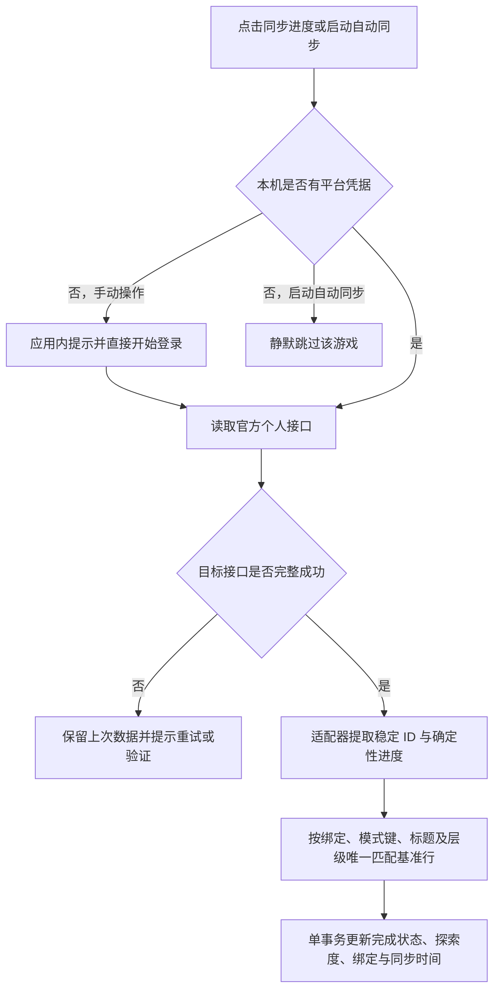

# Gtask 同步架构基准

状态：基准表 + 个人进度覆盖架构已实施
更新时间：2026-09-15（Asia/Shanghai）

> 本文是修改同步代码前必须阅读的架构基准。旧的公开/个人双目录、来源切换、个人语义复核和个人元数据补标方案已退役，不得恢复。

## 1. 权威边界

- 内置活动、周期挑战、地图层级和游戏版本窗口由持久基准表提供。
- 基准表拥有结构事实：标题、分类、标签、时间窗、周期规则、模式键、地图层级和稳定内部键。
- 登录后的官方个人接口只拥有账号事实：可验证完成状态、手动挑战记录和探索百分比。接口响应中同时出现的官方名称与档期可被单独脱敏为维护观察，但不能直接拥有或覆盖公共目录。
- 个人数据必须唯一匹配既有基准行后才能写入进度；未知记录、歧义匹配或无效结构不得创建目录项。
- 用户手动完成状态优先。接口没有可靠完成语义时保留用户状态，不猜测。
- `custom` 是唯一可新增、编辑、删除的用户版块；内置结构只允许完成状态交互。

### 1.1 Agent 工作模式

以上边界描述的是普通运行时和公共基准维护模式。Agent 另有一个必须由用户明确开启的软件维护模式：此时 Codex 作为本机管理员，可以使用通用 MCP 命令、仓库工具和部署工具维护软件本体。软件维护模式不改变个人同步的职责，也不能被隐式带入一个正在执行的基准维护任务；任务开始时必须明确当前模式。

## 2. 基准表生命周期

应用直接嵌入累计的 `updates/catalog.json`，并通过与远程更新相同的事务消费器应用。新事实统一由差异编译器生成，维护标准见 `catalog-maintenance.md`。以下历史种子保留首发存量和兼容能力，不再要求维护时重复修改：

- `baseline-catalog.ts`：版本窗口和活动；
- `cycle-catalog.ts`：周期挑战模式与滚动规则；
- `map-catalog.ts`：严格两级的地图目录。

启动时种子以 `verifiedAt` 比较新旧。包内表只覆盖更旧数据，不能把后台维护得到的新表倒退。运行时只允许执行已经发布在基准里的确定性生命周期规则：限时活动到达已发布结束时间后可彻底删除；周期挑战到期后按已发布滚动规则原位进入下一期并清除旧期完成状态，不能直接删除；版本窗口按已经发布的常规周期滚动。若周期规则、锚点或时间缺失，宁可保留原项等待 Agent 校正，也不能由软件猜测或从个人数据推导。地图保持稳定键和两级结构。版本窗口优先使用已核验的精确起止时间；精确窗口过期且新校时尚未到达时，按每款游戏独立配置的常规周期生成低置信度预测窗口。当前四款游戏的兜底周期均为 42 天，官方延期、缩短或其他特殊排期可随时覆盖预测值。

本机 Codex 专用 MCP 可排队 `public_catalog` 维护任务，核验活动、周期、地图或版本窗口。个人同步成功后，应用只保存不含账号标识、完成状态、分数、探索度和凭据的官方档期观察；维护端先比较这些第一方观察与当前基准，字段完整且无冲突时可直接引用，缺失或冲突字段再查公开资料。每次维护仍须检查指定版块的完整范围，再与当前持久基准逐项比较：时间变化才校时、内容变化才增删改、没有变化就只记录核查结果而不重写数据。普通用户不能使用该 MCP，只接收核验后发布到 `updates/catalog.json` 的公共增量：客户端启动时按设置检查 Gitee/GitHub，严格校验远程清单协议后在一个数据库事务中更新 `public_schedule`。远程清单不能提交完成状态、探索度、凭据或 `custom` 项；任一游戏或地图层级校验失败时整批回滚，继续使用上一次持久基准。旧镜像不能覆盖更新的本地发布时间。大型结构、适配器或程序变更仍通过软件版本发布。

## 3. 个人进度同步

2026-09-14 审计落实：公共事实使用独立的 `public_catalog_item_state` 核验时间和退役记录，个人同步时间不能充当清单修订时间；启动补齐地图也必须使用包内真实核验时间。内置种子不能复活退役项或覆盖已经维护的周期窗口。公开退役保留原行和个人进度，更新的明确公开决定才可重新启用；到期限时活动仍按已发布结束时间清除。

远程清单回执（修订、发布时间、内容哈希）与清单写入同一个数据库事务，随备份一起恢复。外部 JSON 只保存检查冷却等状态，不能证明数据库已经应用清单。同修订但内容不同的镜像也视为冲突，自动选择模式以 GitHub 为准。

周期同一期校时保留状态；真正换期时记录旧期历史、清除完成状态及旧绑定。延迟累计清单不能将模式退回已经结束的旧期。协议 v2 的公共时间记录保存规则生效边界、未来周期/版本例外以及缺截止时间活动的复核义务；未来窗口不覆盖仍活跃的一期，运行时按已发布边界执行。

- 每个版块独立同步；应用启动时按设置逐游戏、逐支持版块串行执行一次。
- 米游社服务原神、星铁和绝区零；库街区服务鸣潮。只在适配器确实支持的版块显示按钮。
- 部分响应、验证失败、取消、凭据失效或写入异常均不修改上次成功结果。
- 活动日历的普通生命周期状态和进度数字不等于“活动全部完成”；只有接口明确提供的玩家“全部完成”布尔字段可以覆盖完成状态，没有该字段时只用于匹配。
- 周期挑战的产品语义是“本期存在必须由玩家手动完成的关卡、区域或目标记录即完成”，不要求满星、满分、最高层或全部奖励。
- 完成证据使用三态：明确有记录、明确无记录、未知。缺字段、非法字段、缺失嵌套列表不能当作零记录；未知不会抹掉上次进度。鸣潮塔区资格按可验证名称识别，不能依赖列表位置。
- 同一次同步的个人进度与脱敏档期观察必须一同成功或回滚；同游戏同版块的并发请求复用执行。请求结束时再次检查凭据，退出或切换账号后丢弃旧请求结果。
- 自动继承、减负结算、扫荡、快速通过/快速解锁、预生成层级、阵容和汇总星数本身不算手动挑战记录；鸣潮终焉矩阵 `passBoss` 只表示快速通过结果，不能单独把周期标为已完成。
- 鸣潮战绩接口中名称类似时间的数值字段不能直接按 Unix 时间解释；未验证的档期字段不得参与过期判定，个人同步只投影可靠的手动挑战记录，周期窗口继续使用公共基准。
- 个人同步不能调用公共周期目录补全、档期预测、过期删除或时间校准逻辑。接口同时返回的名称或档期只能用于匹配，或另存为供 Agent 核验的脱敏观察，不能修改清单结构和时间；尚未开始的基准行也不能被接口残留的旧期记录提前标为完成。
- 地图接口只更新匹配行的官方探索百分比；不能生成新的一级/二级目录，也不能改变父子关系。若当前个人快照提供一级地区进度，必须优先保存并在重启、公共清单更新后继续使用该值；只有当前快照未提供一级值、但提供了二级地区进度时，才按完整公共子地区目录计算平均值。个人数据不能被软件自己的平均算法覆盖。
- 原神个人接口的沉玉谷汇总项是已确认的特殊形态：`id=10/type=Offering/parent_id=0` 返回零占位，同次响应的 `11/12/13` 才提供子区进度。只有三个预期子区唯一、完整且全满时确认汇总完成；任一已知子区未满则记录未完成但不编造汇总百分比；缺项、重复或出现额外分区时不能推断全部完成。该例外不影响正常地区的真实零值与至冬等独立总进度，也不改变璃月下的公共两级结构。没有有效进度或完成证据的个人观察跳过写入；手动完成锁同时保护现有完成状态与进度，避免出现勾选完成但显示 0% 的矛盾。

## 4. 数据和事务

- 数据库 schema 当前为 v8。v2 → v3 保留旧个人进度并吸收进基准；v3 → v4 迁移 Agent 标识；v4 → v5 增加脱敏观察和任务阶段；v5 → v6 增加公共修订、退役与回执；v6 → v7 增加查询索引和可见清单修订计数器；v7 → v8 增加公共规则、例外与复核记录。迁移前备份，不覆盖缺少公共修订证明的旧行。
- 旧内置版块中的手动事项迁入 `custom`，不丢标题和完成状态。
- 旧个人复核批次、规则和元数据缓存表在迁移中删除；凭据、备份和用户清单不受影响。
- `source_bindings` 保存官方身份到基准行的机械绑定；`personal_sync_snapshots` 仅作同步审计，不拥有清单结构。个人快照写入器只允许更新已匹配基准行的完成状态、探索度和同步元数据，不能经过目录合并器写入结构或时间。
- `schedule_observations` 只保存可用于公共档期核验的脱敏名称和时间，不保存账号作用域、完成状态、分数、探索度或凭据。
- 所有个人进度写入在 `BEGIN IMMEDIATE` 事务中完成，异常整批回滚。
- 个人匹配按批次建立索引，避免逐行读完整目录；快照元数据保留每个游戏/版块最近 64 份及所有仍被当前条目引用的快照。地图当前一级值的证据不能被裁剪。清单修订计数器也跟随事务提交/回滚，空闲轮询不再序列化整个目录。
- 回收站只包含用户手动事项；系统基准项不能通过界面或普通 IPC 删除。

## 5. UI 行为

- 无首次使用引导、数据源选择、公开数据同步、插件安装、Agent 状态或模型设置。
- 新用户直接看到所有基准表和持续时间。
- 支持个人数据的版块显示一个“同步进度”按钮；缺少登录时弹窗内直接提供登录按钮。
- 设置页按游戏提供“启动后自动同步进度”开关。
- 内置卡片不显示来源/分类标签、不提供编辑菜单和新增入口；玩法标签与名称同行。
- 自定义版块保持原有 CRUD、完成状态、批量归档和回收站能力。
- 提前显示开关只影响限时活动；周期挑战在空窗期保留卡片并显示下期开启时间。界面加载以最新请求为准，过期响应不得覆盖当前游戏或已完成的操作。
- 退出先刷新浏览器存储并执行正常 Electron 退出；5 秒后仍未退出才强制收尾，避免设置因立即强杀而丢失。
- 大于 200 条的版块按视口和实际行高渲染，保留完整滚动范围和键盘跨边界导航。每秒只检查时间边界，显示的分钟或开始/结束边界变化时才更新清单时钟。
- “只看未完成”继续隐藏已完成地图父项及子项；未完成子地区单独显示时带上“所属地区 /”上下文，不改变真实层级。至冬总进度可能低于已开放子区平均值，所有已完成子区被筛选隐藏属于正常行为（用户确认，2026-09-15）。

## 维护与验证入口

维护 Skill 只描述流程，实时 MCP 契约负责字段和范围约束。精确领取必须提供 job ID，并区分新领取、恢复、他人占用、已完成、失败、取消和不存在；空结果不代表核查成功。按活动/周期/地图等目标批量提交差异，有效观察复用，无变化只记录核查结论。

`pnpm build` 后运行 `pnpm catalog:check`（可指定 `--input`），用实际消费器在隔离内存库检验公开清单；`--inventory` 导出不含个人字段的目录，`--base/--delta/--output` 编译累计发布文件。检查不读取玩家数据库，也不替代来源核验。v1 保持兼容，v2 支持缺时间例外与已支持算法的规则/未来窗口。日期精度和开服条件不伪造为时间戳。已有 MCP 队列仍是旧应用工作流，独立仓库维护使用 CLI；没有新增常驻任务服务。

`verify.yml` 对后续推送和 PR 运行测试、构建与清单检查；本地验证不代表线上 CI 已执行。更新响应按流限制体积并可取消，清单检查合并并发请求；冷却缓存写失败不能将已提交的更新报告成失败。用户设置与加密凭据采用原子文件替换。

## 6. 修改守则

同步架构变更必须新增或更新回归，至少证明：完整基准始终存在、个人数据不创建或改写结构与时间、失败不改旧数据、手动完成锁受保护、周期减负记录不误判、到期周期只滚动不删除、到期限时活动可以删除、迁移不丢进度、地图只有两级。常规验证运行 `pnpm typecheck`、`pnpm test` 和 `pnpm build`。
