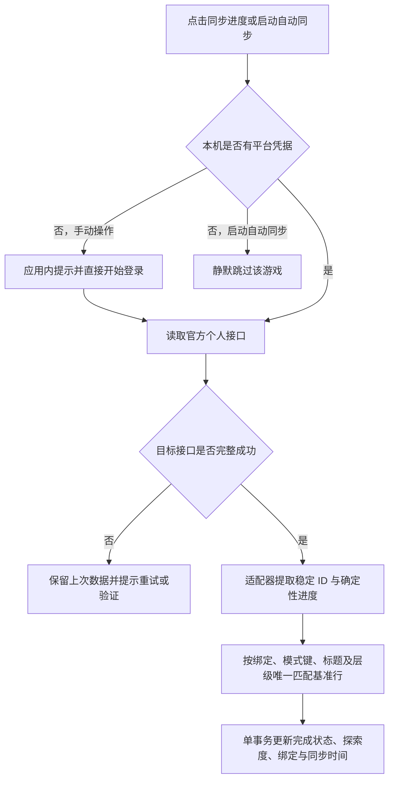

# Gtask 同步架构基准

状态：基准表 + 个人进度覆盖架构已实施
更新时间：2026-08-09（Asia/Shanghai）

> 本文是修改同步代码前必须阅读的架构基准。旧的公开/个人双目录、来源切换、个人语义复核和个人元数据补标方案已退役，不得恢复。

## 1. 权威边界

- 内置活动、周期挑战、地图层级和游戏版本窗口由持久基准表提供。
- 基准表拥有结构事实：标题、分类、标签、时间窗、周期规则、模式键、地图层级和稳定内部键。
- 登录后的官方个人接口只拥有账号事实：可验证完成状态、手动挑战记录和探索百分比。
- 个人数据必须唯一匹配既有基准行后才能写入进度；未知记录、歧义匹配或无效结构不得创建目录项。
- 用户手动完成状态优先。接口没有可靠完成语义时保留用户状态，不猜测。
- `custom` 是唯一可新增、编辑、删除的用户版块；内置结构只允许完成状态交互。

## 2. 基准表生命周期

应用发布包内含当前已验证基准：

- `baseline-catalog.ts`：版本窗口和活动；
- `cycle-catalog.ts`：周期挑战模式与滚动规则；
- `map-catalog.ts`：严格两级的地图目录。

启动时种子以 `verifiedAt` 比较新旧。包内表只覆盖更旧数据，不能把后台维护得到的新表倒退。活动合并后淘汰已到期系统项；周期到期时原位滚动到当前期并清除旧期完成状态；地图保持稳定键和两级结构。版本窗口优先使用已核验的精确起止时间；精确窗口过期且新校时尚未到达时，按每款游戏独立配置的常规周期生成低置信度预测窗口。当前四款游戏的兜底周期均为 42 天，官方延期、缩短或其他特殊排期可随时覆盖预测值。

本机 Codex 专用 MCP 可排队 `public_catalog` 维护任务，核验活动、周期、地图或版本窗口。每次维护先检查指定版块的完整范围，再与当前持久基准逐项比较：时间变化才校时、内容变化才增删改、没有变化就只记录核查结果而不重写数据。普通用户不能使用该 MCP，只接收核验后发布到 `updates/catalog.json` 的公共增量：客户端启动时按设置检查 Gitee/GitHub，严格校验远程清单协议后在一个数据库事务中更新 `public_schedule`。远程清单不能提交完成状态、探索度、凭据或 `custom` 项；任一游戏或地图层级校验失败时整批回滚，继续使用上一次持久基准。旧镜像不能覆盖更新的本地发布时间。大型结构、适配器或程序变更仍通过软件版本发布。

## 3. 个人进度同步

- 每个版块独立同步；应用启动时按设置逐游戏、逐支持版块串行执行一次。
- 米游社服务原神、星铁和绝区零；库街区服务鸣潮。只在适配器确实支持的版块显示按钮。
- 部分响应、验证失败、取消、凭据失效或写入异常均不修改上次成功结果。
- 活动日历的普通生命周期状态和进度数字不等于“活动全部完成”；只有接口明确提供的玩家“全部完成”布尔字段可以覆盖完成状态，没有该字段时只用于匹配。
- 周期挑战的产品语义是“本期存在必须由玩家手动完成的关卡、区域或目标记录即完成”，不要求满星、满分、最高层或全部奖励。
- 自动继承、减负结算、扫荡、快速解锁、预生成层级、阵容和汇总星数本身不算手动挑战记录。
- 周期个人接口仍返回旧期记录时，必须先按接口观测到的旧期窗口完成过期判定，再把当前期进度投影到基准行；不能用当前基准窗口覆盖旧期身份后制造重复稳定键。
- 地图接口只更新匹配行的官方探索百分比；不能生成新的一级/二级目录，也不能改变父子关系。

## 4. 数据和事务

- 数据库 schema 当前为 v4。v2 → v3 会先保留旧个人行的完成/进度并吸收到完整基准，再删除旧个人结构；v3 → v4 原位迁移后台 Agent 的稳定标识。
- 旧内置版块中的手动事项迁入 `custom`，不丢标题和完成状态。
- 旧个人复核批次、规则和元数据缓存表在迁移中删除；凭据、备份和用户清单不受影响。
- `source_bindings` 保存官方身份到基准行的机械绑定；`personal_sync_snapshots` 仅作同步审计，不拥有清单结构。
- 所有个人进度写入在 `BEGIN IMMEDIATE` 事务中完成，异常整批回滚。
- 回收站只包含用户手动事项；系统基准项不能通过界面或普通 IPC 删除。

## 5. UI 行为

- 无首次使用引导、数据源选择、公开数据同步、插件安装、Agent 状态或模型设置。
- 新用户直接看到所有基准表和持续时间。
- 支持个人数据的版块显示一个“同步进度”按钮；缺少登录时弹窗内直接提供登录按钮。
- 设置页按游戏提供“启动后自动同步进度”开关。
- 内置卡片不显示来源/分类标签、不提供编辑菜单和新增入口；玩法标签与名称同行。
- 自定义版块保持原有 CRUD、完成状态、批量归档和回收站能力。

## 6. 修改守则

同步架构变更必须新增或更新回归，至少证明：完整基准始终存在、个人数据不创建结构、失败不改旧数据、手动完成锁受保护、周期减负记录不误判、迁移不丢进度、地图只有两级。常规验证运行 `pnpm typecheck`、`pnpm test` 和 `pnpm build`。
