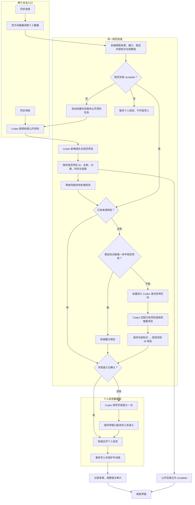

# Gtask 同步架构重构方针

状态：规范清单优先的数据面已实施，等待从零真实账号回归
确认日期：2026-07-27；首次实施：2026-07-28；规范清单门槛：2026-07-29（Asia/Shanghai）

> 本文是底层同步重构的唯一接续基准。实施期间不得清空真实数据库、凭据或手动状态。

## 实施快照（2026-07-28）

- SQLite 已升级到 v23，新增 `source_bindings`、`personal_item_states`、`semantic_profiles`、`sync_observations`，原清单表继续作为兼容的规范目录；来源绑定可保存活动状态的可复用字段规则。
- “同步清单”直接建立规范目录；空目录或目录不完整时点击“同步进度”，应用会在同一次操作中先排队建立该版块的公开规范清单，再绑定并写入个人进度。
- 每个游戏/版块保存 `empty / partial / complete` 目录覆盖度；个人观测在 `complete` 前只暂存，不能被 Codex 领取或写成清单项目。公开资料确认 `complete` 后才开放身份绑定和状态合并。
- 账号/角色作用域由凭据中的稳定身份单向哈希生成；数据库和 Codex 候选均不保存原始 UID、角色号、Cookie 或 Token。
- 已通过的历史语义决策会在启动迁移时回填“平台 + 接口 + 官方 ID → 清单项”绑定。
- 四游戏周期挑战按已验证的 `modeKey` 和“存在挑战记录”语义直接写入；地图只保留一级地区与独立地图，已有目录可按名称和节点类型唯一建立官方 ID 映射，之后直接写入百分比。
- 已绑定个人记录不再用标题启发式匹配；绑定冲突只能交由 Codex 改写。
- 活动完成状态已支持三态：有证据时连同可机械复现的 `completionRule` 写入完成/未完成，规则绑定后重复同步走快路径；证据不足时 Codex 省略 `completed`，数据库记录 `unknown` 并保留用户当前状态。
- 已绑定活动再次审核时只向 Codex 返回规范承载项，不再返回整个版块列表。
- 语义候选指纹升级到 v6 并纳入账号作用域；旧拒绝项可重新入队，旧 v5 已通过结论可回填。
- Gtask MCP 协议增加版本握手和同批次语义候选批量领取；个人候选领取增加规范目录完成门槛。
- 个人数据不再以接口目录反向建立规范清单。公开资料先确定名称、分类、时间和地图层级；个人来源 ID 随后绑定到规范项目，个人状态和手动锁独立保存。
- 自动回归数量以本轮最终运行结果为准。

## 一、当前软件结构

- Electron 桌面外壳负责窗口、系统能力和应用生命周期。
- Vue 3 渲染层负责清单、同步进度、登录、设置、回收站和备份界面。
- SQLite 保存规范清单、个人状态、同步记录、语义候选、配置和回收站。
- 公开资料同步由 Codex 联网检索活动、周期、版本和地图目录。
- 米游社、库街区个人适配器负责登录并采集官方个人数据。
- 语义审核队列把个人候选交给 Codex 判断归属、匹配和完成状态。
- MCP 向 Codex 提供受控的清单读取、任务领取和增删改工具。
- 数据库写入层负责类型、范围、事务、手动锁和固定事项保护。
- `safeStorage`/Windows DPAPI 负责本地凭据加密。
- `Documents\GachaTaskManager` 保存数据库与备份，不假定“文档”位于 C 盘。

## 二、当前实际同步流程

### 公开清单

用户点击同步清单后，应用创建公开资料任务，Codex 联网建立或校正规范清单，再通过 MCP 机械写入 SQLite。

### 个人进度

当前四款游戏的个人适配器几乎都返回 `items: []` 和 `reviewCandidates: [...]`。当前真实路径分为首次和后续两种：

```text
官方采集器
→ 最小字段整理
→ 检查当前版块规范清单覆盖度
→ empty/partial：自动排队公开资料任务，个人观测暂存
→ 公开规范清单 complete
→ 已有来源绑定与字段语义：机械写入
→ 未绑定、冲突或未知语义：Codex 异常审核
→ SQLite
```

协调器仍保留直接合并 `items` 的兼容路径，但在规范清单完成前会把个人 `items` 转为待处理观测，禁止直接创建清单。

### 历史边界

在“全部个人数据交给 Codex”之前，最近一版采用混合方案：

- 活动进入 Codex 语义审核。
- 原神、星铁、绝区零和鸣潮的周期挑战走本地确定性解析。
- 原神、鸣潮地图探索度走本地确定性解析。
- 星铁、绝区零没有可用的个人地图百分比时保持公开目录不变。

相关历史节点：

- `c494eb0`：个人活动语义进入 Codex。
- `5b6653f`：仍保留周期和受支持地图的机械快路径。
- 当前未提交改动：进一步把周期及受支持地图也改成 Codex 候选。

## 三、当前方案的根本问题

1. Codex 位于每次个人同步的热路径中，同一批数据会反复消耗时间和 Token。
2. 地图几十至上百条记录逐条审核，吞吐量和并发体验不可接受。
3. 数据库没有持久的“官方个人接口 ID → Gtask 清单项目 ID”绑定表。
4. 一个 `remoteKey` 同时承担内部规范身份和来源身份，匹配公共项目后经常丢失个人接口 ID。
5. 名称、时间和标题相似度被迫反复参与身份判断，容易重复或错位。
6. 活动接口字段含义不统一，却要求 Codex 必须输出 `completed: true/false`，会产生误判和漏判。
7. 已经研究清楚的字段语义没有版本化缓存，Codex 会重复研究同一接口。

## 四、目标架构原则

### 1. 三层职责

- 控制面：Codex 建立规范清单、解决首次身份映射、研究未知字段语义。
- 数据面：应用根据已确认的官方 ID 绑定和字段语义高速写入个人状态。
- 异常面：只有新增、改名、冲突、接口变化或无法匹配的数据进入 Codex。

### 2. Codex 不再处理重复日常数据

Codex 仍是业务语义权威，但不应每次重新判断已经确认过的项目；它建立的映射和语义规则必须被持久保存并复用。

### 3. 软件只执行可证明唯一的机械规则

软件可以执行接口分区、ID 精确查询、数值转换、范围检查、事务写入和已确认规则；不得根据标题关键词或模糊时间猜测业务含义。

### 4. 名称只用于显示，不作为主要身份

项目身份使用 Gtask 内部 ID；每个外部平台的官方 ID 单独保存。名称修正不得破坏个人状态绑定。

### 5. 完成状态内部采用三态

- 有明确个人完成证据：写入完成。
- 有明确个人未完成证据：写入未完成。
- 字段含义不明或证据不足：不修改原状态。

公开资料只能建立清单和时间，不能声明个人完成状态。

## 五、已实施的双入口同步流程



补充边界：

- “没有官方 ID”不等于允许凭空伪造 ID。只要采集器提供官方 ID、模式键、区域键或接口内稳定记录键，就可作为来源身份；若来源根本没有稳定身份，Codex 可以建立规范项目，但该记录仍保持未绑定并在以后再次核验。
- 第一次个人同步在空目录下会自动触发公开规范清单任务，随后可能需要 Codex 批量建立来源绑定；同一来源身份第二次开始通常走机械快路径。
- 两个入口都允许用户发起增量更新，但只有公开资料流程能声明目录完整。个人接口发现的新 ID 会作为观测进入异常队列，不能直接把其目录层级或分类当作规范结构。

## 六、目标数据边界

重构时应把目前混在清单记录中的不同职责拆开：

- `catalog_items`：规范清单项目及其显示属性。
- `source_bindings`：平台、接口、官方 ID 与 Gtask 项目 ID 的持久关系。
- `personal_states`：个人完成状态、探索度、观察时间和账号范围。
- `semantic_profiles`：已验证的接口字段语义及适配器版本。
- `sync_observations`/`sync_audit`：本次官方观察值、执行结果和可追溯来源。

表名可以在实施时调整，但职责不能再次合并回单一 `remoteKey`。

## 七、各版块的目标策略

- 活动：规范清单由 Codex 建立；个人活动 ID 首次绑定后复用；只有已验证为玩家进度的字段才能机械更新完成状态。
- 周期挑战：稳定模式和周期绑定完成后，已验证的“存在本期挑战记录”机械写入，不再逐条交给 Codex。
- 地图探索：首次建立官方区域 ID 与目录节点绑定，之后几十至上百条百分比全部机械批量写入。
- 任务：继续固定主线和支线，仅由公开资料执行版更校时。
- 不支持的个人字段：保留公开清单和已有状态，不伪造、不猜测。

## 八、实施顺序

### 阶段 0：建立可恢复基线

1. 盘点并保存当前未提交工作树，明确唯一源码、当前插件和当前试用包版本。
2. 将旧发布目录、临时缓存和真实源码分开管理；清理前先确认目标，不能误删用户数据或当前候选包。
3. 冻结当前用户数据库，补充迁移前安全备份、恢复演练和基线测试。
4. 修复或隔离现有 `database is locked` 风险，将数据库写入收敛到可重试的单写入队列。
5. 评估 `node:sqlite` 的正式发布风险；若迁移驱动，必须先完成兼容与回滚测试。

### 阶段 1：补齐任务与协议可靠性

1. 完成公开任务、个人请求、语义候选和 Codex Worker 的端到端取消；取消后不得继续写入。
2. 修复被拒绝候选因指纹去重无法重试的问题，未解决失败不得“秒完成”或标记成功。
3. 增加桌面端、插件与 MCP 的协议版本握手；版本不兼容时明确提示更新，不以字段缺失继续运行。
4. 为官方接口增加结构版本和关键字段检测；平台接口变化应明确标为“接口结构已变化”，不误报登录失效。
5. 在设计个人状态表时先确定账号、角色和服务器隔离键，防止切换 UID 后状态串号。
6. 按 [Codex 代理与 WebSocket 重试排查记录](./codex-proxy-websocket-troubleshooting.md) 完善网络诊断：识别真实 `1/5`～`5/5` 与 HTTP fallback，优先让 Gtask 自己启动的 Worker 使用进程级 HTTP 兼容模式，禁止用永久用户级代理环境变量修复。
7. 网络提示必须保留用户选择：继续等待、本次改用 HTTP、查看说明；不得静默修改 Windows 代理或用户全局 Codex 配置。

### 阶段 2：重构同步数据模型

1. 新增来源绑定、个人状态、字段语义和审计结构，不破坏旧表。
2. 从现有 `remoteKey`、个人项目和语义审核历史尽可能回填绑定；无法确认的保持未绑定。
3. 一个规范项目可绑定多个平台与接口身份，但个人状态必须按账号/角色范围隔离。
4. 保留升级前备份、事务迁移、失败回滚和旧数据兼容读取。

### 阶段 3：恢复机械快路径

1. 先恢复周期和地图的机械快路径，并通过新绑定表替代名称启发式合并。
2. 活动按接口逐个确认字段语义；无法证明个人完成含义的字段保持不写。
3. 将当前语义审核队列改成异常队列，只接收未绑定、冲突、改名和未知字段。
4. Codex 建立绑定或字段语义后重放原始观察值，不要求用户重新登录或重新采集。
5. 采用影子比对验证新旧结果，确认无回归后再移除旧的全量 Codex 路径。

### 阶段 4：诊断、数据治理与交互收尾

1. 增加不含凭据和账号标识的脱敏诊断包，包含协议版本、同步阶段、接口结构错误和数据库争用信息。
2. 为长期增量清单建立有证据的过期/错误归档规则；来源单次遗漏仍不得删除项目。
3. 更新 UI 进度，使“直接写入、等待异常审核、重新执行、取消、完成”对用户清晰可见。
4. 地图和长活动列表达到性能阈值时启用折叠懒加载或列表虚拟化，不提前重写已流畅的界面。

### 阶段 5：发布可靠性

1. 验证单文件便携版临时解包、重复启动、恢复后重启、路径含中文、杀毒软件拦截和异常断电场景。
2. 完成正式安装包、代码签名、SmartScreen、自动更新、崩溃恢复和第三方许可证检查。
3. 使用全新用户、旧数据库升级、多账号切换和四游戏并发同步进行最终端到端验收。

## 九、验收标准

- 同一批个人数据第二次同步时，已绑定且语义已确认的项目不再创建 Codex 任务。
- 地图大批量进度通过单次事务机械写入，Codex 只处理新增或冲突节点。
- 名称修改不丢失个人状态，不产生重复项目。
- 活动模糊字段不会自动改成完成或未完成。
- 手动项目、手动完成锁、固定主线/支线/周常继续受到保护。
- 每次个人状态都能追溯到平台、接口、官方 ID、观察时间和使用的语义规则版本。
- 新增游戏只需增加采集适配器和首次映射，不复制一套新的业务判断器。
- 同步取消后所有采集、审核和写入均停止，其他游戏或版块任务不受影响。
- 数据库并发写入不再弹出 `database is locked` 主进程错误。
- 插件或官方接口结构不兼容时明确停止并说明原因，不写入部分解释的数据。
- 切换账号、角色或服务器不会复用另一身份的个人状态。
- 旧数据库升级失败可以自动回滚，备份可恢复且不会丢失凭据和手动项目。
- WebSocket 系统代理路径异常时，本次 Gtask 同步可以直接改用 HTTP/SSE，不经历五次超时，也不污染其他软件的代理环境。

## 十、下一轮开发接续指令

下一轮开始时先阅读本文，不直接沿用“全部个人数据交给 Codex”作为最终目标。先核对当前未提交工作树和数据库迁移版本，再按“可恢复基线 → 队列与协议可靠性 → 新增数据结构 → 回填绑定 → 恢复机械快路径 → 缩小 Codex 队列 → 影子验收 → 发布加固”的顺序实施。

除非用户明确要求，下一轮不得清空真实数据库、凭据或手动状态，也不得用一次性标题规则代替来源绑定表。
