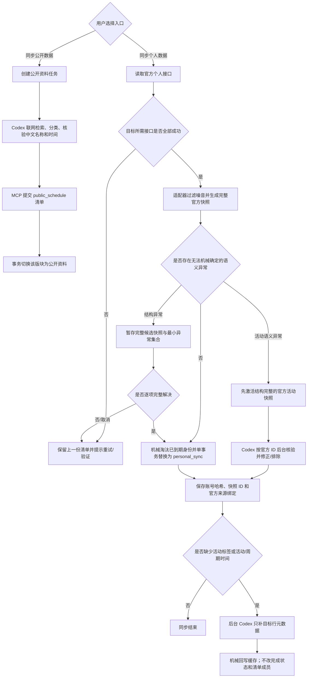

# Gtask 同步架构基准

状态：双数据源隔离、个人异常审核旁路、个人元数据旁路与固定后台配置已实施
更新时间：2026-08-08（Asia/Shanghai）

> 本文是后续 AI 修改同步代码时必须先读的唯一架构基准。旧的“公开规范目录 + 个人状态融合”方案已经退役，不得恢复。

## 1. 不可破坏的原则

- “同步公开数据”和“同步个人数据”是两个彼此隔离的数据入口，不再尝试把两者按标题、时间或模式键融合成同一行。
- 公开资料是无法登录个人平台时的完整兜底清单；完成状态由用户手工维护。
- 个人数据来自已登录的官方接口。一次完整同步成功后，该游戏/版块切换为个人清单，公开资料及该版块普通手动项被替换；`custom` 自定义清单永远保留。
- 用户显式点击“同步公开数据”时，该版块再切换回公开资料清单。不同版块可以分别选择不同来源。
- 任何部分响应、结构错误、凭据失效、取消或写入失败都不能切换数据源，也不能修改上一份完整个人快照。
- 个人同步不等待公开清单、不做跨源名称相似度匹配。确定的官方 ID、进度、挑战记录和父子结构直接走机械快路径。具有稳定官方身份且结构完整的活动即使生命周期或完成字段仍需核验，也先以空标签个人快照立即激活，再由 `personal_review` 按官方 ID 后台修正或排除；只有无法安全写入的结构异常（例如缺失地图父级）继续暂存并在整批解决后激活。已激活个人项缺失的玩法标签与活动/周期时间进入 `personal_metadata` 旁路。

## 2. 软件结构

- Electron 主进程：窗口、登录、官方接口调用、同步控制、取消和应用生命周期。
- Vue 3 渲染层：清单、进度、登录、设置、回收站和备份交互。
- SQLite：清单、版块当前数据源、个人快照、官方 ID 绑定、同步状态和审计。
- Codex Worker + MCP：`public_catalog` 联网建立公开清单；`personal_review` 只解决暂存个人快照中的语义异常；`personal_metadata` 只补既有个人事项的标签与时间。三者契约和写入权限彼此隔离。
- 米游社/库街区适配器：把官方个人响应转换为完整、目标版块限定的 `personal_sync` 快照。
- `safeStorage`/Windows DPAPI：在用户目录中加密登录凭据，数据库清理不得连带删除凭据。

## 3. 当前同步流程

## 4. 个人快照规则

- 每个同步项目必须携带 `provider + endpoint + externalId`；账号使用凭据中稳定身份的 SHA-256 作用域，不保存 UID、Cookie 或 Token。
- `events` 只允许 `limited_event`，`cycles` 只允许 `endgame`，`exploration` 只允许 `exploration`。
- 地图父子关系完整时由官方个人响应直接提供并机械写入。层级缺失或冲突时只把异常节点交给 Codex 核验；Codex 可以联网确认真实一级/二级归属，但不得读取或融合 Gtask 的公开清单，也不得猜测。最终二级地区的父级必须存在于同一份待激活个人快照中。
- 公开地图缺少官方一级探索度时，一级地区按直属二级地区的进度做简单平均，并在子项编辑、完成切换及目录增删后立即重算；个人快照中的官方一级探索度不得被该派生值覆盖。
- 周期挑战使用内置模式目录固定 `modeKey`、显示名称和可验证的周期策略；官方个人接口未返回尚未挑战的固定模式时，只补当前一期未完成占位，不伪造官方期号。“存在本期必须手动挑战的关卡、区域或目标记录”即完成，不要求满星、满分或打完全部关卡。官方减负机制自动继承、扫荡或快速解锁的记录必须排除；证据只允许来自已验证手动目标的明确布尔标记、战斗明细或正数战绩值，汇总星数、最高层、预生成数组、对象、阵容和关卡模板本身不算挑战记录。接口仍返回的上一期记录只用于学习周期并淘汰其官方身份，不能占用当前模式名额；已公布但尚未开始的下一期不进入清单，因此周期版块只显示当前可执行的一期。
- 已知周期到期后，应用把上一期写入内部历史并原位切换为当前预测期，清除旧官方绑定；官方接口或公开数据随后校正时间与正式期号。一次跨过多个周期时只生成当前一期。公开数据校时确认官方延期时可恢复上一期的手工完成状态。
- 机械预测能确定当前窗口时，占位直接携带起止时间和剩余时间；预测信息不足时仍先机械建立固定名称占位，再立即进入 `personal_metadata` 旁路补齐当前期时间。每个周期目标显式携带 `timeWindowPolicy`：默认 `full_cycle`，只有经验证确实按阶段维护的模式才使用 `current_playable_phase`。不得因为响应中存在名称相似的时间字段就推断其语义。周期校时不得以 unresolved、过期窗口、未来窗口、领奖期限或猜测时间结束任务。
- 周期挑战的官方身份可能跨期稳定。`personal_metadata_cache` 中已过期的周期时间不得套用到新快照；官方再次返回同一已知模式但暂无新时间时，应立即恢复当前期事项并重新校时，上期的到期身份不能永久阻止它出现。
- 活动日历中已过期项目和已知周期挑战标题在适配器端过滤，防止挑战重复进入活动版块。
- 数据库在所有游戏共用的个人快照入口再次机械检查 `endsAt`。已经到期的 `limited_event`/`endgame` 会从当前列表和回收站硬删除，并按 `provider + endpoint + externalId` 留下不可恢复身份标记；只有官方后来给出晚于当前时间且晚于旧结束时间的新窗口才视为排期修正。
- 官方活动状态字段若不能证明“玩家完成整个活动”，适配器必须省略 `completed`，不能猜测。相同个人活动再次同步时保留用户手工状态。
- 完整新快照中已不存在的旧个人项目会删除；这是官方快照替换语义，不使用回收站墓碑阻止它重新出现。
- 回收站只保存用户手动创建并显式删除的事项。`public_schedule` 与 `personal_sync` 系统清单不提供用户删除入口，也不能通过通用归档接口进入回收站；同步纠错或完整快照替换需要移除系统项时直接在事务内硬删除。同步永远不能恢复、更新或删除回收站中的手动事项。

## 5. 原子性与取消

- 官方接口响应先完成完整性、凭据、稳定 ID、类型、范围和结构校验，再执行一次 `BEGIN IMMEDIATE` 数据库事务。活动的生命周期和完成语义不再作为激活闸门：结构完整的活动快照先写入，脱敏后的最小异常集合同时进入 `personal_review_batches`，后台结论随后原子修正当前快照。只有无法满足机械完整性的结构异常继续保持旧清单不变。
- 事务同时完成：创建快照审计、移除竞争来源、写入/更新个人项目、删除快照外旧个人项、保存官方 ID 绑定、更新版块来源与成功时间。
- 取消在接口读取后、写入前再次检查；取消个人异常任务会结束对应 Worker，已取消或已被替换的 jobId 不得迟到提交。
- 切换来源会取消旧的 `personal_review` 和 `personal_metadata`，使旧 Worker 无法在稍后回写。

## 6. Codex 的边界

- Gtask 本地 Worker 只有在同步插件确实“已安装且已启用”时才允许启动；仅检测到 Codex CLI、历史 Agent 心跳或应用内置插件安装包都不代表已经接入。公开数据同步必须先安装插件。个人数据仍可先走完全确定的机械快路径；若产生 `personal_review`，完整候选快照保持暂存并明确提示安装插件，不得先启动一个无法回写的 Codex 进程，也不得把任务误判为失败。插件安装完成后由状态检测自动续跑暂存任务。
- Codex 是公开资料的业务语义权威；在个人数据中只作为异常语义权威。`personal_review` 可以决定候选在当前个人版块内 include/exclude、活动身份与完成字段规则、未知周期身份以及异常地图层级；`personal_metadata` 只允许更新契约点名的标签/时间字段。
- 游戏级版本校时采用两级时间来源：优先写入官方确认的精确维护时刻；精确公告尚未发布时，Codex 用当前版本官方开始时间、后续公开排期与既往版更节奏交叉核验可靠暂定值并降低置信度。后续官方公告以同一版本身份覆盖暂定时间。结果写入独立 `game_version_windows`，不创建清单事项；该例外不能扩散到活动或周期窗口。
- 官方个人接口中的稳定 ID、确定进度、挑战记录和结构化父子关系属于适配器的机械事实，不进入 Codex 热路径。
- 解析器技术失败、凭据失效和不完整响应仍直接保留旧数据并报错；Codex 不代替登录或猜测缺失的官方事实。只有已脱敏且具备稳定官方身份的语义异常进入旁路，不把几十上百条正常记录逐条交给 Codex。
- 个人审核结论按 `provider + endpoint + externalId + target` 缓存。后续同一官方身份先机械复用；活动完成布尔值必须由缓存的字段规则重新读取本次 `observedStatus`，不能复用上次结果。
- 数据库只做类型、范围、身份唯一性、事务和固定数据保护，不按名称或时间替 Codex/适配器做业务判断。
- 后台调度固定提供 6 个执行槽位，不再因单次网络重试或空闲内存动态缩容。任务按优先级 `personal_review`、`personal_metadata`、`public_catalog` 领取；每游戏最多并行 2 项。联网任务和 Sol 不再额外限制为 4 项或 2 项，避免全部使用 Sol 时把实际并发暗中压低。
- 不再提供自动切换模型或推理强度的“智能”策略。所有任务从领取到结束始终使用设置页中的同一配置，默认 `gpt-5.6-sol / medium`；用户可以直接改为其他受支持模型和推理强度。语义无法完成或超时只结束当前任务，不再换档拉长流程；临时基础设施故障可使用原配置重试一次。
- 单次执行和整项任务都有时间预算；整项预算只累计真实 Worker 运行时间，排队不计时。`ai_schedule_job_attempts` 继续记录实际模型、推理强度和耗时用于审计，但不驱动自动升级。
- 同步进度采用固定的产品阶段：排队、读取数据、联网检索、核对信息、整理清单、更新清单、重试、等待验证和终态。Agent/适配器上报的 `message` 只作为内部诊断保存在任务记录中，主进程不把它传给渲染层；界面只根据 `source + target + phase + current/total + retryKind` 生成固定文案。不得再用关键词黑名单过滤自由文本，也不得从自由文本反推凭据、网络或业务状态。
- `personal_review` 和 `personal_metadata` 的实现阶段在进入界面前统一投影为“核对信息”或“更新清单”；公开资料的读取阶段投影为“联网检索”。因此契约名、字段路径、语言和时区等内部细节不会因 Agent 自由填写进度说明而出现在产品界面。

## 7. 数据库基准

- 当前 schema：v2；现有 v1 数据库会安全迁移，系统周常被移除，用户手动建立的旧周常保留为 `custom`。
- `checklist_items.source` 区分 `public_schedule`、`personal_sync` 和 `manual`。
- `game_version_windows` 独立保存每款游戏的当前版本窗口；它不属于任何清单版块。
- `personal_sync_snapshots` 保存完整个人快照审计；`checklist_items.source_snapshot_id` 标记当前来源批次。
- `source_bindings` 保存官方来源身份到个人清单项目的机械绑定。
- `personal_metadata_cache` 按官方身份与输出语言缓存已核验标签/时间，使后续个人快照可以机械复用；`personal_expiry_tombstones` 阻止已到期官方身份从旧响应复活。
- 活动标签使用版本化稳定 ID。接口在 `activityTagCatalog` 中声明可用词汇及语义，但词表不是待分配清单。Codex 只能引用已注册 ID，确有新玩法时可通过专用工具注册 `custom.*` 标签；有可靠玩法依据时提交 1～5 个自适应标签，没有可靠依据时允许保持空白或标为未确认，宁缺勿错。逐标签说明只作为可选审计信息。清单展示层按当前语言本地化，不保存模型自由文本；标签契约升级会使旧元数据标签缓存失效并重新补全。
- 公开活动目录的同步状态只由目标覆盖范围、稳定身份和必要字段决定；标签未知属于可后续补全的元数据，不把完整目录降级为 `stale`，`新增 0、更新 N` 也是正常成功结果。
- `personal_review` 只判断个人活动的生命周期、版块归属和可机械复现的完成字段，不再顺手决定玩法标签。首次个人活动先以空标签激活官方快照，再由审核任务按稳定官方 ID 修正/排除，最后由独立 `personal_metadata` 联网补齐标签；机械层只校验稳定 ID、标签 ID、数据形状和事务边界，不根据名称选择标签。
- 个人活动异常必须显式给出 `eventScope=limited|permanent|unknown`。只有 `limited` 可以进入活动快照；常驻内容和无法确认的候选均排除，应用不以“缺少结束时间”自行猜测生命周期。
- `personal_review_batches` 保存等待 Codex 的完整个人快照基础项与最小异常集合；`personal_review_rules` 保存可机械复用的个人身份语义决定。它们都不得引用公开清单 itemId。
- `ai_schedule_jobs` 保存任务状态、尝试次数和当前分配模型；`ai_schedule_job_attempts` 保存每次真实运行的模型、推理强度、耗时和失败类型，用于可靠重试、时间预算与审计。
- `cycle_period_history` 保存自动换期前的完成状态与时间窗，只用于延期校时和审计；正式官方周期 ID 仍只来自官方数据，预测器不得生成。
- `sync_target_states.catalog_source` 表示每个版块当前激活的数据源；账号作用域和快照 ID 只在数据库内部保存。

## 8. 验收标准

- 空数据库可直接点击“同步个人数据”，不创建公开资料任务。结构完整的新活动立即建表并显示，后台审核只按官方 ID 修正生命周期与完成语义；完全确定的周期和地图直接建表。只有异常地图层级等无法安全落库的数据在审核完成前保持原清单不变。
- 同一官方 ID 重复同步保持项目 ID 稳定；账号切换或完整快照变化会替换旧个人数据。
- 部分接口失败后，项目数量、进度、完成状态和当前来源完全不变。
- 公开与个人来源之间切换后，同一版块不能同时出现两套普通同步项目。
- 自定义清单在任何切换中保留；游戏版本窗口不参与清单来源切换。
- 活动中不出现周期挑战；地图结构完全来自官方个人响应且无孤立二级节点。
- 同一活动官方 ID 首次核验后，后续同步复用分类/完成字段规则；新的状态值按本次官方响应机械计算，不重复消耗 Codex。
- 同步成功标识显示当前来源和本次成功时间，而不是旧的尝试时间。
- 关闭应用或取消同步后没有残留写入或后台任务。
- 超过 6 项的批量同步持续排队而不是失败；单个任务超时只结束自己，不切模、不缩容、不取消其他任务，也不把排队时长算作审核耗时。

## 9. 后续修改规则

修改同步架构前先运行全量测试并新增能证明“来源隔离、完整快照、失败不改旧数据、异常决定可复用”的回归。不得为修复个别名称再次加入跨源模糊匹配、公开目录前置依赖或全量 Codex 个人审核。

## 10. 全局同步入口

- 首次初始化的大型来源选择只接受第一次点击：选择一经确认便立即关闭引导，不允许个人与公开两套初始化同时启动。之后按“插件检测 → 个人凭据 → 同步批处理”的阶段推进；未登录时只保存待继续意图，不预创建版块任务。
- 顶部“全局同步”只是菜单，不直接执行任务；菜单顺序固定为“同步个人数据”“同步公开数据”“版本校时”。
- 同一游戏、同一版块的个人数据与公开数据任务互斥。个人接口读取、个人异常审核或个人元数据补全进行中时，公开任务不得插队切换该版块；反向亦然。界面禁用冲突入口，主进程仍执行相同校验，避免绕过界面产生竞态。
- 全局个人数据按适配器支持范围依次执行活动、周期事项、地图探索。相邻两次官方平台请求间隔 3 秒；等待 Codex 的个人异常审核或元数据补全不占用这段间隔。凭据失效、官方验证、限流、取消或明确失败会停止本批次，不机械重试后续版块。
- 全局公开数据不是来源切换操作：独立版本校时始终可执行；活动、周期事项和地图探索仅在尚未初始化或当前已经使用公开数据时参与。当前使用个人数据的版块必须跳过。
- 从个人数据切回公开数据只能从对应版块菜单显式发起，并在应用内确认。不得通过全局公开同步、初始化引导或后台任务隐式覆盖个人快照。
- 全局状态由版本时间、活动、周期事项和地图探索四个同步目标的真实状态聚合；时间戳取最新成功/尝试时间，混合来源必须明确显示，不再依赖可能过期的 `all` 状态行。
