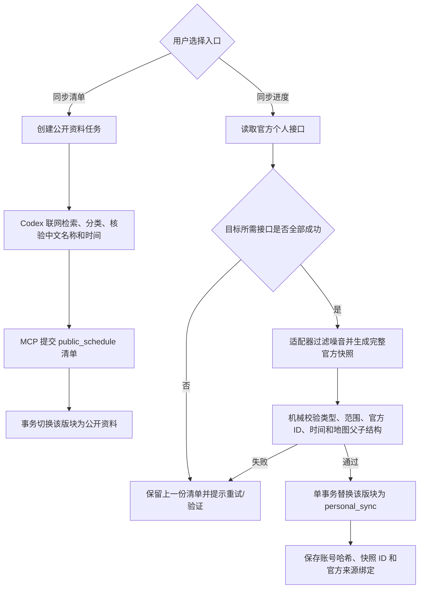

# Gtask 同步架构基准

状态：双数据源隔离架构已实施
更新时间：2026-07-31（Asia/Shanghai）

> 本文是后续 AI 修改同步代码时必须先读的唯一架构基准。旧的“公开规范目录 + 个人状态融合”方案已经退役，不得恢复。

## 1. 不可破坏的原则

- “同步清单”和“同步进度”是两个彼此隔离的数据入口，不再尝试把两者按标题、时间或模式键融合成同一行。
- 公开资料是无法登录个人平台时的完整兜底清单；完成状态由用户手工维护。
- 个人数据来自已登录的官方接口。一次完整同步成功后，该游戏/版块切换为个人清单，公开资料及该版块普通手动项被替换；固定任务、固定周常和 `custom` 自定义清单永远保留。
- 用户显式点击“同步清单”时，该版块再切换回公开资料清单。不同版块可以分别选择不同来源。
- 任何部分响应、结构错误、凭据失效、取消或写入失败都不能切换数据源，也不能修改上一份完整个人快照。
- 正常个人同步不启动 Codex、不等待公开清单、不做名称相似度匹配。适配器只输出自己能够证明的官方事实。

## 2. 软件结构

- Electron 主进程：窗口、登录、官方接口调用、同步控制、取消和应用生命周期。
- Vue 3 渲染层：清单、进度、登录、设置、回收站和备份交互。
- SQLite：清单、版块当前数据源、个人快照、官方 ID 绑定、同步状态和审计。
- 公开资料 Codex Worker + MCP：联网检索并提交公开清单；只处理 `public_schedule` 数据。
- 米游社/库街区适配器：把官方个人响应转换为完整、目标版块限定的 `personal_sync` 快照。
- `safeStorage`/Windows DPAPI：在用户目录中加密登录凭据，数据库清理不得连带删除凭据。

## 3. 当前同步流程

## 4. 个人快照规则

- 每个同步项目必须携带 `provider + endpoint + externalId`；账号使用凭据中稳定身份的 SHA-256 作用域，不保存 UID、Cookie 或 Token。
- `events` 只允许 `limited_event`，`cycles` 只允许 `endgame`，`exploration` 只允许 `exploration`。
- 地图父子关系由官方个人响应直接提供；二级地区的父级必须是同一快照中的一级地区。不得用公开地图目录、标题猜测或 Codex 重排个人地图。
- 周期挑战按官方稳定模式和周期身份写入；“存在本期任意挑战记录”即完成。固定“周常”由应用维护，每周一重置，不属于个人快照替换范围。
- 活动日历中已过期项目和已知周期挑战标题在适配器端过滤，防止挑战重复进入活动版块。
- 官方活动状态字段若不能证明“玩家完成整个活动”，适配器必须省略 `completed`，不能猜测。相同个人活动再次同步时保留用户手工状态。
- 完整新快照中已不存在的旧个人项目会删除；这是官方快照替换语义，不使用回收站墓碑阻止它重新出现。

## 5. 原子性与取消

- 官方接口响应只在内存中暂存；全部成功且机械校验通过后，才执行一次 `BEGIN IMMEDIATE` 数据库事务。
- 事务同时完成：创建快照审计、移除竞争来源、写入/更新个人项目、删除快照外旧个人项、保存官方 ID 绑定、更新版块来源与成功时间。
- 取消在接口读取后、写入前再次检查；取消后不得产生部分数据。
- 切换来源会拒绝旧的待处理/已领取语义候选，使旧 Worker 无法在稍后回写。

## 6. Codex 的边界

- Codex 是公开资料的业务语义权威，负责联网检索、分类、名称、时间、标签和公开目录的增删改。
- 官方个人接口中的稳定 ID、确定进度、挑战记录和结构化父子关系属于适配器的机械事实，不进入 Codex 热路径。
- 如果适配器无法形成完整快照，当前版本直接保留旧数据并报错，不把几十上百条原始记录逐条交给 Codex。未来如增加异常审核，必须使用独立暂存区并在整批解决后原子激活。
- 数据库只做类型、范围、身份唯一性、事务和固定数据保护，不按名称或时间替 Codex/适配器做业务判断。

## 7. 数据库基准

- 当前 schema：v27。
- `checklist_items.source` 区分 `public_schedule`、`personal_sync` 和 `manual`。
- `personal_sync_snapshots` 保存完整个人快照审计；`checklist_items.source_snapshot_id` 标记当前来源批次。
- `source_bindings` 保存官方来源身份到个人清单项目的机械绑定。
- `sync_target_states.catalog_source` 表示每个版块当前激活的数据源；账号作用域和快照 ID 只在数据库内部保存。
- 旧 `personal_item_states`、`semantic_profiles`、`sync_observations` 暂留作迁移兼容，不得用于恢复跨源融合。

## 8. 验收标准

- 空数据库可直接点击“同步进度”建立个人清单，不创建公开资料任务或 Codex 任务。
- 同一官方 ID 重复同步保持项目 ID 稳定；账号切换或完整快照变化会替换旧个人数据。
- 部分接口失败后，项目数量、进度、完成状态和当前来源完全不变。
- 公开与个人来源之间切换后，同一版块不能同时出现两套普通同步项目。
- 自定义清单、主线、支线和周常在任何切换中保留。
- 活动中不出现周期挑战；地图结构完全来自官方个人响应且无孤立二级节点。
- 同步成功标识显示当前来源和本次成功时间，而不是旧的尝试时间。
- 关闭应用或取消同步后没有残留写入或后台任务。

## 9. 后续修改规则

修改同步架构前先运行全量测试并新增能证明“来源隔离、完整快照、失败不改旧数据”的回归。不得为修复个别名称再次加入跨源模糊匹配、公开目录前置依赖或全量 Codex 个人审核。
